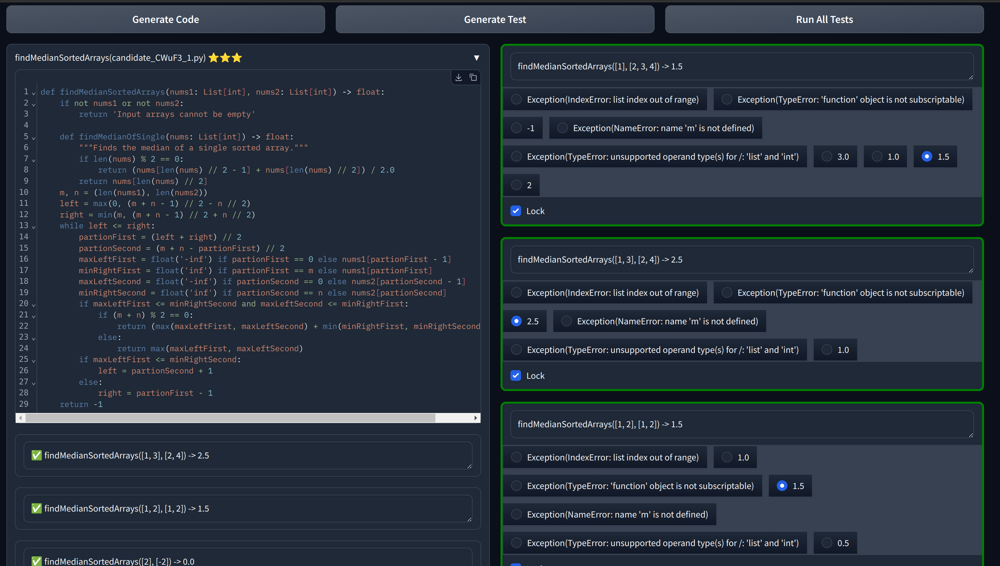

# Geniz

Geniz is an interactive (LLM-based) code-gen tool which makes you effectively solve any hard coding problems (HumanEval/LeetCode/TopCoder) in few minutes by few clicks.

Genis has the all-in-one coding environment. It generates multiple candidate code snippets, multiple test cases, and automatically run test cases against all candidates in parallel, then analyze candidates and prevent user their runtime information spectrum.

Geniz is an experimental project to pratice our vision to AI-dev.




## Owner/maintainer

### Publish to pip hub

```bash
python3 -m pip install --upgrade build
python3 -m pip install --upgrade twine

rm dist/ -rf
python3 -m build
twine check dist/*
twine upload dist/*
```