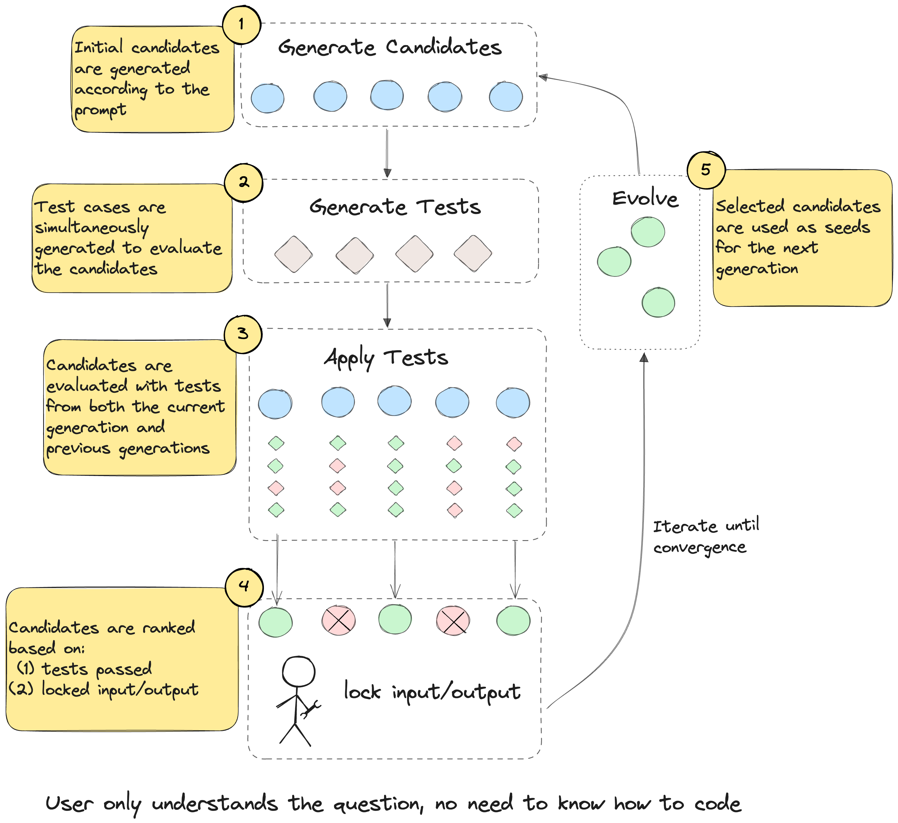

# Geniz

Code generation can be highly sensitive to prompting and initial conditions. Geniz explores an evolutionary approach to code generation, where multiple candidate solutions converge on a solution over multiple generations.

Given an input description of a coding task, the system generates, tests, and ranks a multitude of solutions to find the ones that perform the best.

Geniz includes an interactive codegen app that allows humans to select candidate solutions and evolve them until they converge on a correct solution. The human serves as a flexible fitness function in selecting applicable tests and candidates to survive to the next generation.

Geniz combines recent developed code-gen approaches like [AgentCoder](https://arxiv.org/abs/2312.13010), [Reflexion](https://arxiv.org/abs/2303.11366), and [Self-Consistency](https://arxiv.org/abs/2203.11171). The approach particularly excels with smaller models. We foresee this approach as an economical option for achieving high-quality results with lower hardware requirements.

Benchmark Geniz without human invention on HumanEval dataset.
| Model                           | Baseline | Geniz (without human) |
| ------------------------------- | -------- | --------------------- |
| OpenCodeInterpreter-1.3B        | 48.7%*   | 72.0% (+45%)          |
| Llama-3-70b-instruct            | 81.7%    | 85.9% (+5%)           |
| Phi-3-mini-128k-instruct (3.8B) | 57.9%    | 74.1% (+28%)          |

Note: * is our reproduction.

###  Features
* **Code solution generation**: Geniz generates a variety of potential solutions in parallel.
* **Test generation and execution**: After generation, the system tests each candidate against all test cases and ranks them based on test evaluation and output consistency.
* **Candidate evolution**: New solutions are generated based on the previous generation of candidates.
* **Interactive human feedback**: Users can tweak solutions, modify tests, and select candidates to steer the evolution of better candidate solutions.

### Revolutionizing Coding
Geniz aims to change the way people tackle coding challenges from platforms like LeetCode, TopCoder, and USACO. Rather than spending hours coding and debugging, users can focus on defining the problem's requirements and let the LLMs handle the implementation details.

### Harnessing Local Code-Gen LLMs
Geniz represents the first practical application of local/smaller LLMs, enabling them to solve complex coding problems effectively. By running the LLMs locally, Geniz ensures privacy and allows users to benefit from the latest advancements in language models without relying on external services.

## Getting Started

To get started with Geniz, follow these steps:

* Clone the repository `git clone https://github.com/sudocode-ai/geniz.git`
* Install the dependencies: `cd geniz && pip install -e .`
* (Optional) Prepare keys.json (See keys.json.example), or type in the UI.
* Run the webapp: cd src/geniz/example && python webserver.py

## Contributing

We welcome contributions from the community! If you'd like to contribute to Geniz, please follow our contributing guidelines.
Contact person: [Ning Ren](https://www.linkedin.com/in/renning22/), [Alex Ngai](https://www.linkedin.com/in/alexngai/) and [Randy Song](https://www.linkedin.com/in/randy-song/).

Jon our [discord](https://discord.com/channels/1115708641052471446/1252342616394043446)!

## License

Geniz is released under the MIT License.
