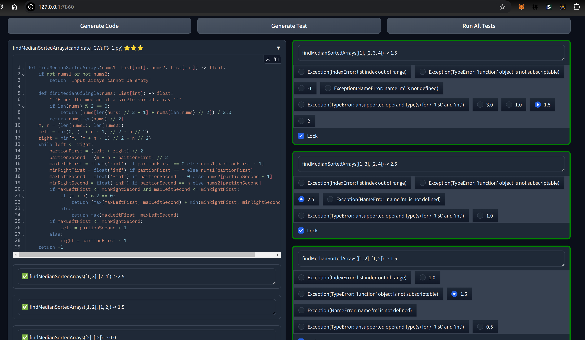

# Geniz

Geniz is an interactive LLM-powered code-gen tool which makes you effectively solve any coding problems (HumanEval/LeetCode/TopCoder) in few minutes by few clicks.




## Owner/maintainer

### Publish to pip hub

```bash
python3 -m pip install --upgrade build
python3 -m pip install --upgrade twine

rm dist/ -rf
python3 -m build
twine check dist/*
twine upload dist/*
```